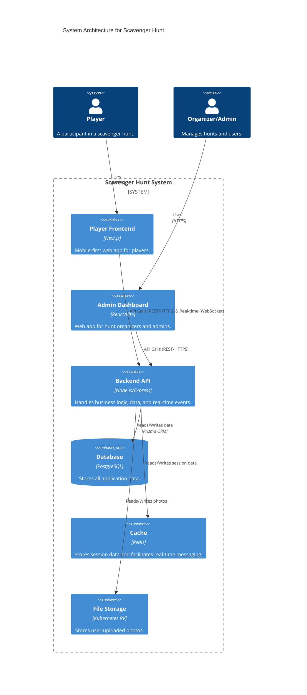
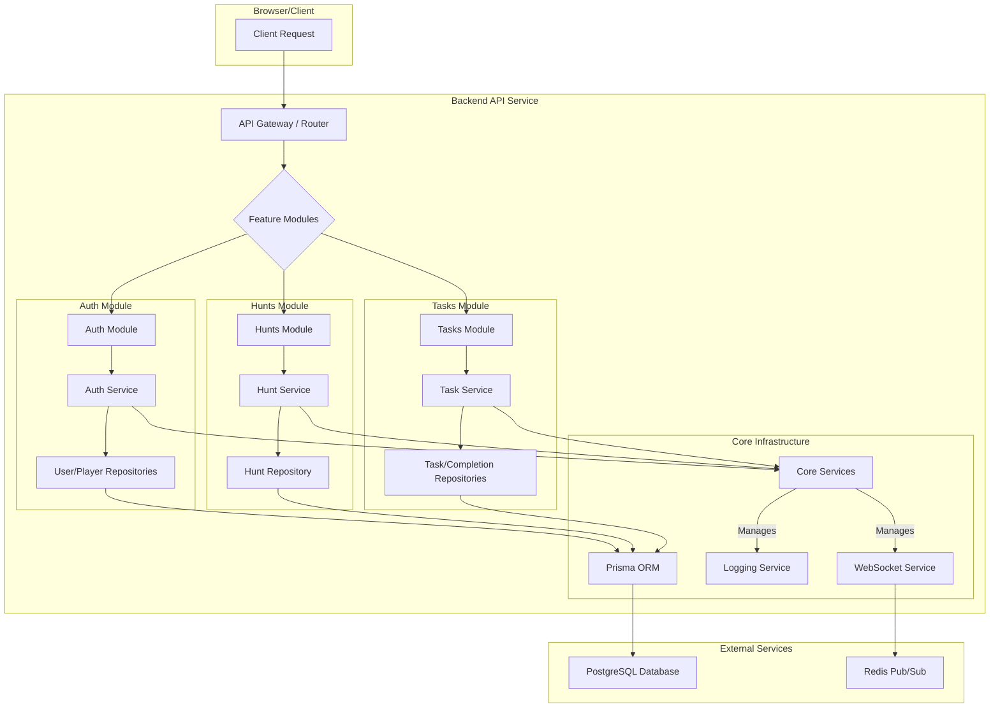
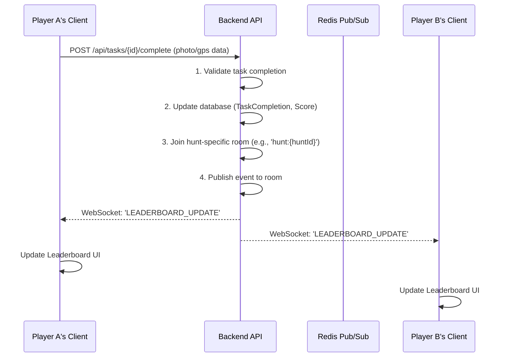
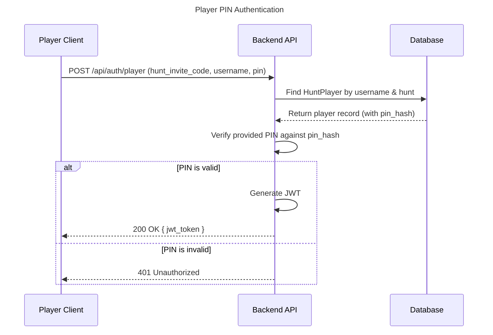

# Implementation Architecture Plan

This document outlines the architectural plan for the Scavenger Hunt application, including high-level system design, backend and frontend architecture, and key process flows.

## 1. High-Level System Architecture

This diagram illustrates the main components of the Scavenger Hunt system and how they interact. It follows a standard container-based model where each service runs independently.



## 2. Backend API Architecture (Modular Monolith)

The backend will be structured as a "modular monolith." This provides a clean separation of concerns by organizing code into feature-based modules, making the application easier to maintain and scale.

### 2.1. Architectural Diagram



### 2.2. Layer Responsibilities

*   **API Gateway/Router:** The entry point for all HTTP requests. It handles routing, top-level middleware (like request logging), and directs requests to the appropriate feature module.
*   **Feature Modules (`Auth`, `Hunts`, `Tasks`):** Each module is self-contained and responsible for a specific domain. It includes its own routes, controllers, services, and repositories.
*   **Service Layer (`Hunt Service`, etc.):** Contains the core business logic. It orchestrates data flow, calls repositories, and interacts with core services like WebSockets.
*   **Repository Layer (`Hunt Repository`, etc.):** Implements the Repository Pattern. This layer is responsible for all database interactions for a specific model, abstracting away the Prisma ORM calls from the business logic.
*   **Core Services:** Shared services available to all modules, such as logging, WebSocket event emission, and caching.

## 3. Frontend Architecture

Both the Admin Dashboard and Player Frontend will follow a similar modern architecture, separating concerns for state management and data fetching.

### 3.1. Architectural Diagram

```mermaid
graph TD
    subgraph "User Interaction"
        A[User] --> B[UI Components (Pages/Views)];
    end

    subgraph "Frontend Application"
        B -- Triggers actions --> C{State Management};
        C --> D[Client State (Zustand/Redux)];
        C --> E[Server State (TanStack Query / RTK Query)];

        E -- Fetches/Mutates data --> F[API Client];
        F --> G[REST API Service];
        F --> H[WebSocket Service];
    end

    subgraph "Backend Services"
        I[Backend API]
        J[WebSocket Server]
    end

    G --> I;
    H --> J;
```

### 3.2. State Management Strategy

*   **Server State (TanStack Query / RTK Query):** All data fetched from the API (hunts, tasks, user profiles) will be managed by a server-state library. This handles caching, background refetching, loading/error states, and mutations automatically.
*   **Client State (Zustand / Redux Toolkit):** Only state that is local to the UI and not persisted on the server will be managed here. Examples include form input values, modal visibility, and theme settings.

## 4. Key Process Flows & Diagrams

### 4.1. Real-time Leaderboard Update Flow

This sequence diagram shows how a player completing a task triggers a real-time update for all other players in the same hunt.



### 4.2. Player Authentication Flow

This diagram shows the process for a player authenticating with their hunt-specific username and PIN.



## 5. Communication and Transaction Types

The system employs two primary communication protocols between the frontends and the backend: **HTTPS** for standard request/response cycles and **WebSockets** for real-time, server-pushed updates. Server-Sent Events (SSE) were considered but not chosen.

```mermaid
graph TD
    subgraph "Clients"
        A[Admin Dashboard]
        B[Player Frontend]
    end

    subgraph "Backend API"
        C[HTTPS (REST API)]
        D[WebSocket Server]
    end

    A -- "All interactions" --> C;
    B -- "Initial Load, Actions (e.g., Task Submission)" --> C;
    B -- "Real-time Updates (Leaderboard, etc.)" --> D;
```

### 5.1. HTTPS (RESTful API)

HTTPS is the foundation for all client-initiated, state-changing actions and data retrieval. It follows a standard stateless request/response model.

*   **Usage:**
    *   **Admin Dashboard:** All communication from the admin dashboard is via HTTPS. This includes creating, reading, updating, and deleting hunts, tasks, and players.
    *   **Player Frontend:**
        *   Initial data loading (e.g., `GET /api/hunts/{id}`).
        *   All authentication requests (e.g., `POST /api/auth/player`).
        *   Submitting a task completion (e.g., `POST /api/tasks/{id}/complete`). The real-time update that follows is sent via WebSocket.
    *   **Security:** All traffic is encrypted using TLS.

*   **Rationale:** This is the industry standard for APIs. It is reliable, scalable, and well-supported by all clients and libraries (like TanStack Query and RTK Query) for handling server state.

### 5.2. WebSockets

WebSockets are used for low-latency, bidirectional communication, which is essential for the real-time features of the player experience. The backend will use a room-based architecture (via Socket.io) to ensure that updates are only sent to relevant clients (e.g., players within the same hunt).

*   **Usage (Player Frontend Only):**
    *   **Leaderboard Updates:** When a player's score changes, the server emits a `LEADERBOARD_UPDATE` event to all clients in that hunt's room.
    *   **Hunt Status Changes:** Organizers can pause, resume, or end a hunt. The server broadcasts `HUNT_PAUSED`, `HUNT_RESUMED`, or `HUNT_ENDED` events to all players in the hunt.
    *   **Task Verification:** When an organizer approves or rejects a photo task, the server sends a `TASK_VERIFIED` event directly to the player who submitted it.
    *   **Player Activity:** Announcing when a new player joins the hunt (`PLAYER_JOINED`).

*   **Rationale:** WebSockets are ideal for server-initiated events. They avoid the overhead of HTTP polling and provide a much more responsive and engaging experience for players during a live hunt.

### 5.3. Server-Sent Events (SSE) - Considered but Not Used

Server-Sent Events (SSE) provide a one-way, server-to-client communication channel over a standard HTTP connection.

*   **Analysis:** While SSE is simpler than WebSockets and suitable for some use cases like news feeds or status updates, it was not selected for this project.
*   **Reason for Rejection:** The `socket.io` library chosen for the WebSocket implementation provides a more comprehensive feature set out-of-the-box, including:
    *   **Room-based broadcasting:** Essential for isolating hunt-specific events.
    *   **Automatic reconnection:** Improves reliability if a player's connection drops.
    *   **Fallback mechanisms:** Ensures compatibility with older browsers or restrictive network environments.
    *   **Bidirectional communication:** While not a primary requirement now, it offers flexibility for future features like in-game chat without adding a new technology.

Given these advantages, WebSockets provide a more robust and future-proof solution for the application's real-time needs.