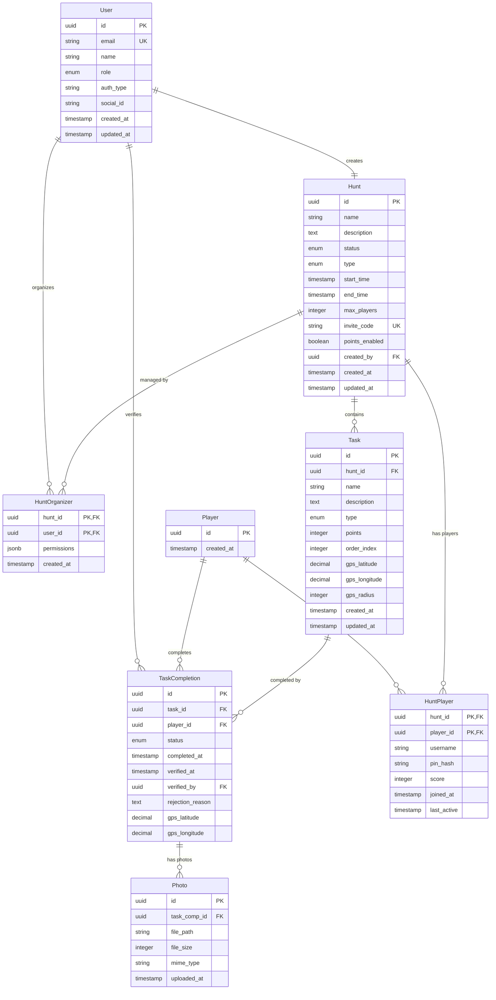

# Scavenger Hunt Data Model Documentation

## Overview
This document describes the data models and relationships for the Scavenger Hunt application. The database uses PostgreSQL and supports features including user authentication, hunt management, task tracking, photo submission, and real-time updates.

## Entity Relationship Diagram

## Entity Definitions

### User
Stores administrator and organizer accounts with social authentication.

| Column      | Type                           | Constraints         | Description                              |
|-------------|--------------------------------|---------------------|------------------------------------------|
| id          | UUID                           | PRIMARY KEY         | Unique identifier                        |
| email       | VARCHAR(255)                   | UNIQUE, NOT NULL    | User's email address                     |
| name        | VARCHAR(255)                   | NOT NULL            | Display name                             |
| role        | ENUM('admin', 'organizer')     | NOT NULL            | User role in the system                  |
| auth_type   | VARCHAR(50)                    | NOT NULL            | Authentication provider (google, facebook) |
| social_id   | VARCHAR(255)                   | NOT NULL            | ID from social auth provider             |
| created_at  | TIMESTAMP                      | NOT NULL            | Account creation timestamp               |
| updated_at  | TIMESTAMP                      | NOT NULL            | Last update timestamp                    |

**Indexes:**
- `idx_user_email` on (email)
- `idx_user_social` on (auth_type, social_id)

### Player
Stores player accounts that are hunt-specific with PIN authentication.

| Column      | Type        | Constraints         | Description                              |
|-------------|-------------|---------------------|------------------------------------------|
| id          | UUID        | PRIMARY KEY         | Unique identifier                        |
| created_at  | TIMESTAMP   | NOT NULL            | Account creation timestamp               |

### Hunt
Stores scavenger hunt information and configuration.

| Column       | Type                                              | Constraints         | Description                              |
|--------------|---------------------------------------------------|---------------------|------------------------------------------|
| id           | UUID                                              | PRIMARY KEY         | Unique identifier                        |
| name         | VARCHAR(255)                                      | NOT NULL            | Hunt name                                |
| description  | TEXT                                              |                     | Hunt description                         |
| status       | ENUM('draft', 'active', 'paused', 'completed')   | NOT NULL            | Current hunt status                      |
| type         | ENUM('competitive', 'cooperative')                | NOT NULL            | Hunt mode                                |
| start_time   | TIMESTAMP                                         |                     | When hunt becomes active                 |
| end_time     | TIMESTAMP                                         |                     | When hunt automatically ends             |
| max_players  | INTEGER                                           |                     | Maximum number of players allowed        |
| invite_code  | VARCHAR(50)                                       | UNIQUE              | Unique code for joining hunt             |
| points_enabled | BOOLEAN                                         | DEFAULT true        | Whether points system is enabled         |
| created_by   | UUID                                              | FOREIGN KEY (User)  | Creator of the hunt                      |
| created_at   | TIMESTAMP                                         | NOT NULL            | Hunt creation timestamp                  |
| updated_at   | TIMESTAMP                                         | NOT NULL            | Last update timestamp                    |

**Indexes:**
- `idx_hunt_invite_code` on (invite_code)
- `idx_hunt_status` on (status)
- `idx_hunt_dates` on (start_time, end_time)

### HuntOrganizer
Junction table for multiple organizers managing a hunt.

| Column       | Type          | Constraints                        | Description                              |
|--------------|---------------|------------------------------------|-----------------------------------------|
| hunt_id      | UUID          | FOREIGN KEY (Hunt), PRIMARY KEY    | Hunt identifier                          |
| user_id      | UUID          | FOREIGN KEY (User), PRIMARY KEY    | Organizer identifier                     |
| permissions  | JSONB         | NOT NULL                           | Permissions for this organizer           |
| created_at   | TIMESTAMP     | NOT NULL                           | Association creation timestamp           |

### HuntPlayer
Junction table linking players to hunts with hunt-specific authentication.

| Column       | Type        | Constraints                          | Description                              |
|--------------|-------------|--------------------------------------|------------------------------------------|
| hunt_id      | UUID        | FOREIGN KEY (Hunt), PRIMARY KEY      | Hunt identifier                          |
| player_id    | UUID        | FOREIGN KEY (Player), PRIMARY KEY    | Player identifier                        |
| username     | VARCHAR(50) | NOT NULL                             | Display name in this hunt                |
| pin_hash     | VARCHAR(255)| NOT NULL                             | Hashed PIN for authentication            |
| score        | INTEGER     | DEFAULT 0                            | Current score in hunt                    |
| joined_at    | TIMESTAMP   | NOT NULL                             | When player joined hunt                  |
| last_active  | TIMESTAMP   | NOT NULL                             | Last activity timestamp                  |

**Indexes:**
- `idx_huntplayer_username` on (hunt_id, username) - UNIQUE
- `idx_huntplayer_score` on (hunt_id, score DESC)

### Task
Stores individual tasks within a hunt.

| Column        | Type                                    | Constraints           | Description                              |
|---------------|-----------------------------------------|-----------------------|------------------------------------------|
| id            | UUID                                    | PRIMARY KEY           | Unique identifier                        |
| hunt_id       | UUID                                    | FOREIGN KEY (Hunt)    | Parent hunt                              |
| name          | VARCHAR(255)                            | NOT NULL              | Task name                                |
| description   | TEXT                                    | NOT NULL              | Task instructions                        |
| type          | ENUM('photo', 'checkbox', 'gps')       | NOT NULL              | Task completion type                     |
| points        | INTEGER                                 | DEFAULT 0             | Points awarded for completion            |
| order_index   | INTEGER                                 | NOT NULL              | Display order in hunt                    |
| gps_latitude  | DECIMAL(10, 8)                          |                       | GPS latitude for location tasks          |
| gps_longitude | DECIMAL(11, 8)                          |                       | GPS longitude for location tasks         |
| gps_radius    | INTEGER                                 |                       | Acceptable radius in meters              |
| created_at    | TIMESTAMP                               | NOT NULL              | Task creation timestamp                  |
| updated_at    | TIMESTAMP                               | NOT NULL              | Last update timestamp                    |

**Indexes:**
- `idx_task_hunt_order` on (hunt_id, order_index)
- `idx_task_type` on (type)

### TaskCompletion
Records player task completions and verification status.

| Column           | Type                                          | Constraints                        | Description                              |
|------------------|-----------------------------------------------|------------------------------------|------------------------------------------|
| id               | UUID                                          | PRIMARY KEY                        | Unique identifier                        |
| task_id          | UUID                                          | FOREIGN KEY (Task)                 | Completed task                           |
| player_id        | UUID                                          | FOREIGN KEY (Player)               | Player who completed task                |
| status           | ENUM('pending', 'approved', 'rejected')      | NOT NULL                           | Verification status                      |
| completed_at     | TIMESTAMP                                     | NOT NULL                           | Completion timestamp                     |
| verified_at      | TIMESTAMP                                     |                                    | Verification timestamp                   |
| verified_by      | UUID                                          | FOREIGN KEY (User)                 | Organizer who verified                   |
| rejection_reason | TEXT                                          |                                    | Reason for rejection                     |
| gps_latitude     | DECIMAL(10, 8)                                |                                    | GPS latitude at completion               |
| gps_longitude    | DECIMAL(11, 8)                                |                                    | GPS longitude at completion              |

**Indexes:**
- `idx_taskcompletion_player_task` on (player_id, task_id) - UNIQUE
- `idx_taskcompletion_status` on (status)
- `idx_taskcompletion_task_status` on (task_id, status)

### Photo
Stores submitted photos for task verification.

| Column         | Type         | Constraints                        | Description                              |
|----------------|--------------|------------------------------------|-----------------------------------------|
| id             | UUID         | PRIMARY KEY                        | Unique identifier                        |
| task_comp_id   | UUID         | FOREIGN KEY (TaskCompletion)      | Related task completion                  |
| file_path      | VARCHAR(500) | NOT NULL                           | Path to file in storage                  |
| file_size      | INTEGER      | NOT NULL                           | File size in bytes                       |
| mime_type      | VARCHAR(100) | NOT NULL                           | MIME type of file                        |
| uploaded_at    | TIMESTAMP    | NOT NULL                           | Upload timestamp                         |

**Indexes:**
- `idx_photo_task_completion` on (task_comp_id)

## Key Relationships

1. **User Management**
   - Users (admins/organizers) authenticate via social login
   - Players authenticate per-hunt with username/PIN
   - Multiple organizers can manage a single hunt

2. **Hunt Structure**
   - Hunts contain multiple tasks
   - Tasks can be photo submission, checkbox, or GPS-based
   - Hunts can be competitive or cooperative

3. **Task Completion Flow**
   - Players complete tasks creating TaskCompletion records
   - Photo tasks require photo upload
   - GPS tasks verify location
   - Organizers verify completions

4. **Scoring System**
   - Points tracked in HuntPlayer.score
   - Updated when tasks are approved
   - Shared in cooperative mode

## Database Constraints and Business Rules

1. **Authentication Rules**
   - User email must be unique
   - Player username must be unique within a hunt
   - PIN stored as hash, never plain text

2. **Hunt Rules**
   - Only one hunt status transition allowed: draft → active → paused/completed
   - Invite codes are unique across all hunts
   - Max players enforced at join time

3. **Task Rules**
   - GPS coordinates required only for GPS-type tasks
   - Points can be 0 or positive only
   - Task order must be unique within a hunt

4. **Completion Rules**
   - One completion per player per task
   - Photos required for photo-type tasks
   - GPS verification automatic for GPS tasks

## Performance Considerations

1. **Expected Load**
   - 10-20 concurrent users per hunt
   - Low overall volume
   - Real-time updates via WebSocket

2. **Optimization Strategies**
   - Index on frequently queried fields
   - Composite indexes for common joins
   - JSONB for flexible permission storage

3. **Data Retention**
   - All data retained indefinitely
   - Photos stored on persistent disk
   - Consider archival strategy for old hunts